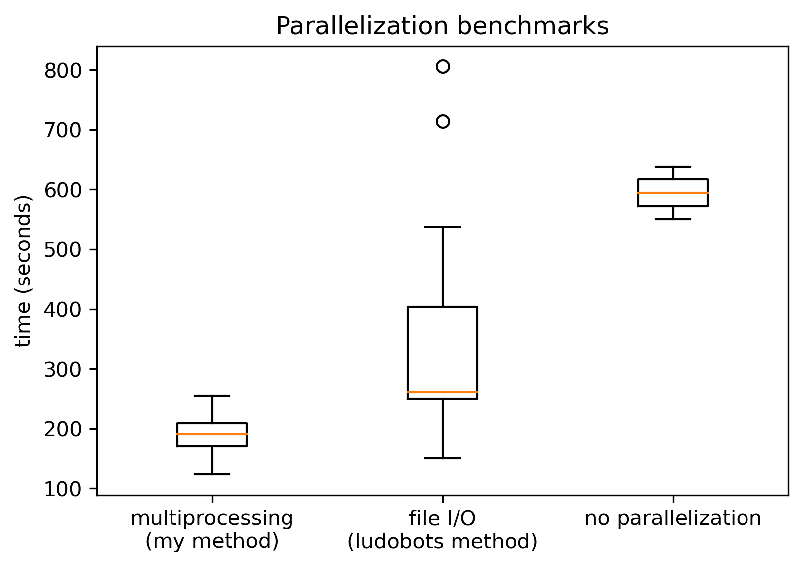

## IMPORTANT

This was written as part of my final project for COMP_SCI 396: Artificial Life.

---

This is a tale of why thermal management is important and why running more code simultaneously doesn't necessary make your code faster, told through the my project [simulating virtual robotics in Python](https://github.com/ellifteria/pyro-corpus) building off of the [ludobots online course](https://reddit.com/r/ludobots).

## Background

Recently, I've been working on simulating and evolving artificial robots for my research in the [Xenobot Lab](https://xenobot.group) and for my Artificial Life course at Northwestern.
I got started with simulated robots using the [ludobots course](https://reddit/r/ludobots).
Overall it's a very good course.
If you're interested in simulated robotics, evolutionary computation, artificial life, or really even just want a really cool project on your website, I highly recommend it!
There was one big part of it, however, that struck me as odd from the beginning: the way the course implemented parallelization.

The basic idea of what the course has you do is simple: just run the code executing the robot simulation multiple times at once instead of executing each simulation sequentially.
And it does this by literally executing a Python file (let's call it the worker and the function that directs all the worker files the boss) repeatedly, once for each time simulation that needs to be run.
Each worker runs the simulation and saves the robot's fitness in a text file.
Then, the boss collects all the fitnesses from the text files and uses them to rank the robot designs.

Now, even if you don't use parallelization in your code, you're probably a bit uneasy with this idea; something just doesn't sit right about it.
And, well, that's probably because you shouldn't do parallelization this way.

Why?

For starters:

1. This system requires file I/O and file I/O is slow. File I/O requires writing and reading from your computer's hard drive which is much slower than manipulating items in memory.
2. File I/O can lead to nasty issues, for example, trying to read a file while its being written to.
3. It's not necessarily parallelizing anything. Just because we've executed a bunch of files at once doesn't necessarily mean they're all being executed at once. If you only have one CPU core, your computer will only be able to execute one thread at a time. Therefore, if you tell it to run all the files at once, it will just have to rapidly switch between executing files still performing only one operation at a time.

Ok, so it's not the greatest idea, but will it still speed up your code?

Spoiler alert: yes, sort of.

If you have a simple simulation and you to run it a couple of times, using this parallelization will almost certainly make your code execute more quickly.
So, since I was following the ludobots course, I implemented this parallelization in my code and went on my way.

And this system worked fine, for a while.
However, I was soon doing much more advanced evolutionary runs: evolving tens of thousands of virtual robots that included maybe dozens of body parts.
And my computer started having a hard time handling the code I was executing.

This continued on until I started a new project in the Xenobot Lab.
This project requires a lot more simulations before and a lot more complicated robot designs.
And by now there had been enough bugs I had had to squash and enough `sleep(0.2)` that I had to add to my code to make sure that the file I/O parallelization wouldn't crash my evolutionary run and make me lose hours of work that I was ready to try a new method.

## Enter Multiprocessing

Multiprocessing is one method of *actual* parallelization.
It essentially involves making use of multiple processors within a computer's CPU to execute function concurrently.
In Python, the `multiprocessing` package allows you to send a function to as many of your CPU cores as you'd like and it will have them all execute concurrently, then give you back the results.

In theory, this is easy enough to implement and is proper parallelization.
So, I set about adding it to my code.

This involved a lot of rewriting existing code to make use of calling functions and handling returns since, now, there was no more file I/O to be involved.
But, eventually, I got it working properly.

And what does one do when they have a new method of running some code?
Well, they compare it to the existing method to prove that their new way is better.

## Benchmarking (Attempts)

In order to compare my method to the existing parallelization method, I decided to run both methods to simulate 20 evolutionary runs of 10 generations of evolution with 100 robots per generation.
For a control, I also decided to run the evolution without parallelization for 10 runs of the same generation number and size.
In total, this came out to 50,000 simulations.

Or, it would have, if things didn't go wrong very quickly.

Since I had just finished writing my parallelization method, I decided to execute it once and time it.
The result?

```text
execution time: 109.820 seconds
```

Not bad at all.

Quick back of the napkin math gives us about 2,200 seconds for all 20 runs.
That comes out to about 37 minutes but let's say approximately 45 minutes just to be safe.

I did this same thing for the other two methods and got the about `250 seconds` and `600 seconds` for the file I/O parallelization and no parallelization respectively.

Same back of the napkin math... we'll be done under 240 minutes!
That's less than four hours.

So, I set my parallelized benchmark to run the full 10 runs and forgot about it for an hour.
Here's what I saw:

```text
mean execution time:  190.636  seconds
std. dev. execution time:  36.150  seconds
```

Now, I should've gotten worried here.
Doubling the amount of time it takes to execute the runs would *not* give me enough time to finish my desired benchmarks.
Why I didn't stop and reconsider here, I don't know.

Instead, I set the file I/O method benchmark to run.
While this one was running, however, I noticed that my computer was getting hot.
**VERY** hot.
This is, I'm sure you're aware, not very good.
However, being an M1 Mac, my fans didn't spin up at all; so, I assumed it was fine.
After about half an hour though, I got much more concerned and decided to check on its progress.

I was horrified by what I found.

The latest run had taken `806.098 seconds`.
The one before that? `714.150 seconds`.
The one before that? `540.273 seconds`.

This was not good.

What's worse was how my cores were faring.


I probably don't need to tell you that those are not good temperatures.

Suffice it to say, I killed the code after this, meaning I did not end up getting the results that I wanted.

I did manage to get a bit more data in the though, leading to the following number of runs:

- my multiprocessing parallelization &times;20
- ludobots file I/O parallelization &times;10
- no parallelization &times;5

I plotted the data I had to see how the methods compare, knowing that my data had not been gathered properly; imperfect results are better than no results.



To get the timing for the ludobots method, I had to wait in between evolution runs.
Otherwise, my computer cores would get too hot and the execution times would slow down dramatically.
Hence, while the multiprocessing and no parallelization tests were done under more realistic conditions, the file I/O one was done under the most ideal circumstances possible.
If many simulations were being run for long periods of time, the file I/O method would likely perform much worse.

From here, it's safe to conclude that multiprocessing parallelization is the fastest method between these three, especially for long runs.

## Analysis; or, Why Does the Ludobots Method Do That?

So, the ludobots method is not great to begin with and gets worse over time.
The most noticeable difference between the ludobots method and the other two methods during execution was thermal performance.
The file I/O parallelization scheme got very hot, very fast, and stayed that way.
Neither the multiprocessing method nor the no parallelization method got nearly as hot.
As for why the multiprocessing method didn't get as hot, I don't know. It's probably in how the `multiprocessing` package executes the function.
Or, perhaps it has to do with extra computing power needed to call the Python scripts and write to the hard drive in the file I/O method.
Regardless, my multiprocessing parallelization stayed comparably cool.
The no parallelization method doesn't get as hot because it's not as taxing at all.
Running a single Python function over and over again sequentially, one execution at a time, is nowhere near as taxing as running 10&mdash;one per core&mdash;at once.

My hypothesis, therefore, as to the reason why the ludobots method fares so poorly at longer times, is that thermal throttling begins occurring, slowing down the execution.
Thermal throttling is the process by which a computer slows down the frequency of its cores at higher temperatures in order to protect its components; running a computer too hot for too long and permanently damage it.
Therefore, it automatically reduces its performance in an attempt to cool down its cores.
Thermal throttling would definitely explain what happened on my machine and would make sense given the temperatures the CPU reached when running the file I/O parallelization method.

This highlights just how important proper thermal management is.
Even if a program theoretically should run faster, if your computer gets too hot, it can actually lead to worse performance in the long term as your device slows itself down to try and preserve itself.

Regardless of the exact mechanism, one practical takeaway from this is that using the ludobots parallelization can actually make running simulated robots slower.
Once the computer starts throttling after simulations have been running for a long enough amount of time, the performance of the ludobots parallelization may take such a dramatic hit that it would likely be faster to just run the simulations sequentially.

Or, you know, use actual parallelization.

<!-- - You can find the [ludobots parallelized code here](https://github.com/ellifteria/pyro-corpus)!
- You can find the [multiprocessing parallelized code here](https://github.com/ellifteria/pyro-corpus/tree/multiprocessing)!
- And you find a [simple example of how to implement multiprocessing in ludobots here](https://github.com/ellifteria/ludobots/tree/multiprocessing)! -->

—[ellifteria](https://ellifteria.github.io)
